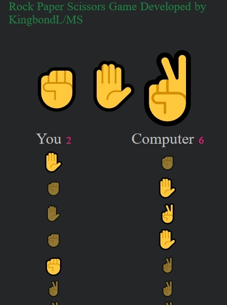

# Rock-Paper-Scissors-Game
RocK Paper Scissors Game using HTML, CSS, JavaScript
Use of CSS grid and flexbox to layout game elements.
Creation of AI to play against it.

About Game:-
Rock paper scissors is a hand game usually played between two people, in which each player simultaneously forms one of three shapes with an outstretched hand. These shapes are "rock", "paper", and "scissors".

The rules are very simple and probably you remember them from your childhood:-

If you choose Rock, you will win against Scissors but lose against Paper.
If you choose Scissors, you will win against Paper but lose against Rock.
If you choose Paper, you will win against Rock but lose against Scissors.

Interesting facts about RPS game :-
Did you know that this game first appeared in China in the 17th century? Yes, it was not invented in Europe or America but in Asia. Europe started to play this game only in 19th century.
Statistics say that people usually choose Scissors in the first round and Rock in the second.
There is a robot developed in Japan which wins with 100% chance. It analyzes movement of your hand muscles to predict what choice you’ll show.

Good advice :-
If you want to win, you need to be a good psychologist to predict the next choice of your opponent. There are many strategies and different people have different patterns of behavior.

But if you follow this advice you will win in most cases. If your last choice was...
... Rock, then choose Scissors in the next round
... Scissors, then choose Paper in the next round
... Paper, then choose Rock in the next round
It will work only with not experienced players. The strategy is based on experiments of Zhejiang University.
#HaveAGoodDay
